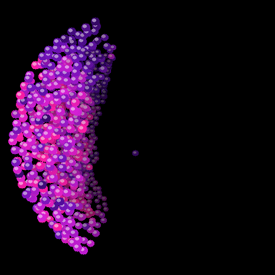

# ESP32 S3 Puddle Dish (Rust)



A 3D particle fluid living inside a [Waveshare ESP32-S3-Touch-AMOLED-1.75-B](https://www.waveshare.com/esp32-s3-touch-amoled-1.75.htm) — round, 466×466. The screen is the front glass of a shallow dish. Tilt the board and the liquid pours to the rim; shake it and it sprays white.

**Puddle Dish is built on [FluidBox](https://github.com/V4C38/esp32-fluidbox)** by [V4C38](https://github.com/V4C38) ([Johannes Tscharn](https://x.com/JohannesTscharn)). FluidBox is the original: Clavet double-density solver, band renderer, IMU, PWR reset — written for the rectangular 1.8" Waveshare board.

This repo is the **Rust** port (`esp-hal` 1.1 + Embassy). The solver is the FluidBox C `sim.c`, compiled with the Xtensa GCC and linked in. Display and tasks are Rust.

**It does not run as smoothly as the C firmware.** The C repo — [esp32-puddledish-c3](https://github.com/digital-4ngels/esp32-puddledish-c3) — is the version that feels right. This one is public as an experiment; motion still pops and never quite settles. If you want the puddle, flash C.

Do not flash the FluidBox 1.8 binary onto a 1.75-B.

## What this is

Same idea as FluidBox / the C port: nine hundred particles, IMU, short **PWR** to reset. Holding PWR still powers the device off. BOOT is left alone.

This repo contains:

- A **fluid simulation** (FluidBox `sim.c`, not a from-scratch Rust solver)
- A **renderer** in Rust, same perspective / depth / velocity colour as the C port
- **IMU + PWR** over I2C (QMI8658, TCA9554 bit 4)

## How it works

- **Rendering** — QSPI DMA bands (22 rows, last band 4). Draw overlaps the transfer.
- **Simulation** — Clavet double-density relaxation, same C source as FluidBox / the C port.
- **Motion** — accelerometer and gyroscope feed gravity and shake.

## Running it

Xtensa Rust toolchain (`espup` / `export-esp.ps1`), then:

```bash
cargo build --release
espflash flash --port COM3 --chip esp32s3 --monitor target/xtensa-esp32s3-none-elf/release/fluidbox
```

Console is **USB serial-JTAG** (`jtag-serial` in `esp-println`), not UART0. Windows often `COM3`.

### Pins (1.75-B)

```
PCLK 38   CS 12   RST 39
D0–D3 = 4, 5, 6, 7
QSPI 40 MHz, column gap x=6
I2C SDA 15 / SCL 14
PWR  TCA9554 0x20 bit 4 (read only)
BOOT GPIO0 untouched
```

## Layout

| Path | Contents |
|---|---|
| `src/` | Rust: display, render, IMU, button, main |
| `native/` | FluidBox C solver (`sim.c`) plus thin host stubs |
| `assets/` | Hero clip (same as the C repo; this port is less settled) |

## Credits

- **[FluidBox](https://github.com/V4C38/esp32-fluidbox)** — V4C38 / Johannes Tscharn. Solver and the original demo. MIT.
- [esp32-puddledish-c3](https://github.com/digital-4ngels/esp32-puddledish-c3) — C port on this board; feel reference.
- Waveshare — ESP32-S3-Touch-AMOLED-1.75-B.

## License

[MIT](LICENSE). FluidBox code remains © 2026 V4C38. Our 1.75-B port is © 2026 digital-4ngels.
